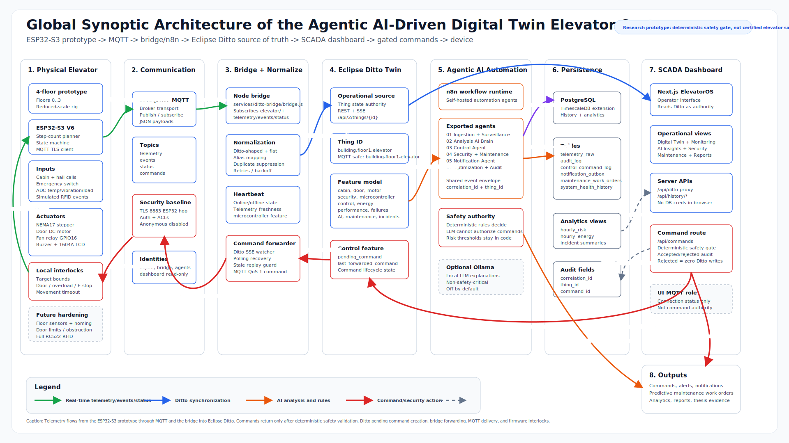

# Smart Elevator Digital Twin — ElevatorOS

[](https://github.com/abdelrahmen-zaouidi/smart-elevator-digital-twin/actions/workflows/ci.yml)
[](LICENSE)
[](https://github.com/abdelrahmen-zaouidi/smart-elevator-digital-twin/releases)

**A safety-gated, local-first digital twin platform for smart and secure elevator
management** — real ESP32-S3 hardware or a physics simulator, MQTT over TLS,
an Eclipse Ditto twin as the single source of truth, agent workflows, and a
SCADA-grade operator console. Every actuation passes a **deterministic command
safety gate** (measured **5.7 µs** median decision time); AI explains, but never
actuates.

> Built as a Master's-thesis research platform. Local-first, fully Dockerized,
> no cloud dependency.

<picture>
  <source media="(prefers-color-scheme: dark)" srcset="docs/features/global-synoptic-architecture-dark.svg">
  
</picture>

## Try it in 5 minutes

```bash
bash scripts/demo/bootstrap-demo.sh          # fresh clone only (idempotent)
docker compose --profile demo up -d --build  # twin provisioning + seeded simulator
cd apps/dashboard && npm install && npm run dev   # ElevatorOS on :3000
```

Full walkthrough (prerequisites, guided 3-minute tour, teardown): **[DEMO.md](DEMO.md)**.
Full manual setup: [SETUP.md](SETUP.md).

## Screenshots

<!-- TODO(maintainer): capture from the live dashboard and commit to docs/media/
     - docs/media/dashboard-synoptic.png   (main SCADA view, demo mode running)
     - docs/media/dashboard-3d-twin.png    (PageTwin 3D scene with sensor overlays)
     then delete this comment. -->
| SCADA console | 3D digital twin |
|---|---|
| *(screenshot pending: `docs/media/dashboard-synoptic.png`)* | *(screenshot pending: `docs/media/dashboard-3d-twin.png`)* |

## Architecture

```text
ESP32-S3 firmware ─┐
                   ├──MQTT/TLS──▶ Mosquitto ──▶ bridge ──REST──▶ Eclipse Ditto ◀── Next.js dashboard
esp32_simulator.py ┘   (auth+ACL)                    │                ▲              (ElevatorOS)
                                                     ▼                │
                                          n8n agent workflows ────────┘
                                          TimescaleDB (telemetry + audit)
```

Commands flow back through a deterministic **safety gate** → Ditto desired
state (`pending_command` intent) → MQTT command topic → device → `COMMAND_RESULT`
acknowledgement. Nothing bypasses the gate; the browser's MQTT identity is
read-only.

**Core invariants** (every document and PR is held to these):

1. **Eclipse Ditto is the single source of truth** — MQTT is ingestion only.
2. **Commands are intents against the twin**, admitted by the deterministic
   safety gate, fanned out by the bridge.
3. **Deterministic rules hold safety authority; AI/LLM output is advisory
   only** (`AUTONOMOUS_ACTUATION_ENABLED=false` by default).

## Feature matrix

| Area | What's implemented |
|---|---|
| Devices | ESP32-S3 firmware (TLS, RFID, LCD 16x4, offline-clock fallback) + physics simulator publishing the identical MQTT contract (seeded, anomaly profiles) |
| Digital twin | Eclipse Ditto thing with 13 features, policy, SSE live updates + REST-poll fallback |
| Command path | Deterministic safety gate (risk scoring, twin-freshness, cooldowns, coalescing, audit) → durable intent → bridge fanout → device ack; **5.7 µs** median gate decision |
| Dispatch | Dual-brain AI-adaptive policy engine — deterministic scorer active, ML challenger in shadow (never promoted without evaluation) |
| Agents | n8n workflows: ingestion/surveillance, risk analysis, control, security + maintenance, notifications (Telegram/email/SMS hooks), optimization + audit |
| SCADA console | ElevatorOS (Next.js/React, shadcn tokens): synoptic view, reactive 3D twin (react-three-fiber), command panel, RFID access control CRUD + logs, history charts, agent activity, platform health strip |
| Data | TimescaleDB history + audit (`/api/history/*`), notification outbox, access log |
| Security | MQTT TLS (pinned local CA) + per-identity ACLs, no anonymous access, secrets gitignored, read-only browser identity, Basic-Auth demo gate |
| AI (advisory) | Optional LLM "why" narration for dispatch decisions (Ollama local / Anthropic API), strictly non-authoritative |
| Ops | `GET /api/system/health` + top-bar status strip, backup/restore scripts with rehearsed drill, 5-minute demo mode, CI |

## Technology stack

| Layer | Stack |
|---|---|
| Firmware | Arduino / ESP32-S3 (Arduino framework), PubSubClient, WiFiClientSecure |
| Broker | Eclipse Mosquitto (TLS + password file + ACL) |
| Twin | Eclipse Ditto (separate compose stack) |
| Bridge | Node.js (MQTT ↔ Ditto REST merge-patch loop + command reconciler) |
| Workflows | n8n (self-hosted) |
| Dispatch engine | Node.js dual-brain (deterministic scorer + linear ML challenger) |
| Dashboard | Next.js / React SCADA console (**ElevatorOS**), server proxies, react-three-fiber |
| Database | PostgreSQL + TimescaleDB |
| Orchestration | Docker Compose (npm-workspaces monorepo) |

## Repository layout

```text
.
├── apps/
│   └── dashboard/                        # Next.js SCADA dashboard (ElevatorOS)
├── services/
│   ├── ditto-bridge/bridge.js           # MQTT ↔ Eclipse Ditto bridge + command reconciler
│   ├── dispatch/dispatchEngine.mjs      # dual-brain dispatch engine loop (champion + shadow)
│   └── simulator/esp32_simulator.py     # Python physics simulator
├── packages/
│   └── shared/                          # safety gate, command lifecycle, dispatch engine, LLM narration
├── firmware/
│   └── main_esp_32_code_smart_elevator_v6/   # ESP32-S3 firmware (uses secrets.h)
├── workflows/
│   └── n8n/                             # exported agent workflows (JSON) + upgrade code nodes
├── infra/
│   ├── docker/                          # Dockerfile.bridge, Dockerfile.simulator
│   ├── mqtt/                            # Mosquitto config (certs/passwordfile gitignored)
│   └── postgres/                        # init + migrations (TimescaleDB)
├── scripts/                             # demo mode, backup/restore, certs, Ditto init, validation, measurement
├── tests/                               # Python simulator unit tests
├── docs/                                # docs index, integration contracts, safety, features, operations
├── evidence/                            # captured validation + drill evidence
├── paper/                               # IEEEtran journal article (LaTeX)
├── docker-compose.yml                   # platform stack (broker, bridge, n8n, postgres, demo profile…)
├── DEMO.md                              # 5-minute demo path
├── SETUP.md                             # full local setup
└── SECURITY.md                          # security baseline + ACL matrix
```

## Validation

Everything runs in [CI](.github/workflows/ci.yml) on each push; locally:

```bash
npm run validate     # node suites + n8n package + python suites + typecheck + lint
```

Measured reference numbers (in-process, `evidence/perf/`): safety gate
**5.7 µs** median (p99 < 20 µs), Brain A dispatch **15.6 µs**, cost-of-safety
**~5.3 µs/command**, MQTT loopback RTT **1.11 ms** TCP / **1.19 ms** TLS.

Claims use three explicit evidence levels: *software-validated (PASS)* /
*documented integration* / *outside scope (documented design)*. Temperature,
vibration and load on the physical rig are potentiometer-simulated; firmware
v6 floor detection is functional open-loop step counting.

## Configuration

All runtime config lives in `.env` (gitignored). Copy `.env.example` and fill in:

- Postgres / TimescaleDB credentials
- n8n encryption key (`openssl rand -base64 24`)
- Ditto endpoint + credentials
- MQTT topic conventions (canonical: `elevator/{mqtt_safe_thing_id}/{telemetry|events|commands|status}`)
- MQTT broker identities (`bridge`, `agents`, `dashboard`, `esp32-elevator`, `healthcheck`)
- Optional Telegram / email / SMS / voice notification channels
- Optional LLM narration (Ollama local or Anthropic API)

For firmware: copy `firmware/main_esp_32_code_smart_elevator_v6/secrets.h.example`
to `secrets.h` and fill in WiFi/MQTT credentials.

## Security

See [SECURITY.md](SECURITY.md) for the full baseline and verification transcripts.
Highlights: MQTT-over-TLS on the ESP32 hop with pinned CA; per-identity ACLs
(only `bridge` may publish commands); anonymous access disabled; secrets
gitignored; browser-side MQTT identity is read-only.

## Documentation

Start at the **[documentation index](docs/README.md)** — it maps every document
by purpose and states the core invariants. Key entries:
[DEMO.md](DEMO.md) · [SETUP.md](SETUP.md) · [SECURITY.md](SECURITY.md) ·
[docs/mqtt-reference.md](docs/mqtt-reference.md) ·
[docs/ditto-twin-reference.md](docs/ditto-twin-reference.md) ·
[docs/safety/command-safety-gate.md](docs/safety/command-safety-gate.md) ·
[docs/features/adaptive-dispatch-engine.md](docs/features/adaptive-dispatch-engine.md) ·
[docs/operations.md](docs/operations.md)

## Project

- [CHANGELOG.md](CHANGELOG.md) — release history (Keep a Changelog / SemVer)
- [ROADMAP.md](ROADMAP.md) — where the platform is heading
- [CONTRIBUTING.md](CONTRIBUTING.md) — dev setup, validation gate, invariants
- [CODE_OF_CONDUCT.md](CODE_OF_CONDUCT.md)

## Status

Research / thesis prototype. Not intended for production deployment without
further hardening (HTTPS on dashboard + Ditto, intra-Docker TLS, secrets
manager, audit retention policy) — tracked honestly in [ROADMAP.md](ROADMAP.md).

## License

[Apache 2.0](LICENSE).
