# Global Synoptic Architecture Diagram Package

Project: Agentic AI-Driven Digital Twin for Smart and Secure Elevator Management

Purpose: thesis-grade and presentation-ready system architecture figure for the
Smart Elevator Digital Twin platform.

## Figure Title

Global Synoptic Architecture of the Agentic AI-Driven Digital Twin Elevator System

## Local Diagram Files

Use these files when Canva or Figma sharing links are blocked by account or
permission issues:

- `docs/features/global-synoptic-architecture-light.svg` for the thesis figure.
- `docs/features/global-synoptic-architecture-dark.svg` for defense slides.

Both SVG files are local, editable vector artwork. They can be opened directly
in a browser, imported into Figma or Canva, or converted to PDF/PNG for LaTeX
and PowerPoint.

## Evidence Basis

This diagram is based on the current repository architecture:

- ESP32-S3 firmware V6 is the primary embedded controller candidate.
- MQTT uses the canonical topic family:
  `elevator/{mqtt_safe_thing_id}/{telemetry|events|status|commands}`.
- Eclipse Ditto is the operational source of truth.
- `services/ditto-bridge/bridge.js` normalizes MQTT telemetry into Ditto and forwards
  accepted Ditto command intents back to MQTT.
- The dashboard command route and deterministic safety gate are the trusted
  command boundary.
- n8n provides six exported workflow agents.
- PostgreSQL/TimescaleDB stores history, audit, command, notification, work
  order, and system-health records.

Do not present Hall floor sensors, door limit switches, calibrated industrial
load cells, or full RC522 RFID hardware as implemented unless final physical
evidence is added. In the current diagram they are shown as planned/future
hardening or simulated/validation-only where appropriate.

## Mermaid Source for Figma/FigJam

Use this Mermaid source with Figma FigJam, Mermaid Live, or Canva import tools.

```mermaid
flowchart LR
    titleNode["Global Synoptic Architecture of the Agentic AI-Driven Digital Twin Elevator System"]

    subgraph physicalLayer["1. Physical Elevator Layer"]
        prototype["4-floor reduced-scale elevator prototype"]
        esp32["ESP32-S3 firmware V6"]
        sensors["Inputs: cabin and hall calls, E-stop, ADC temp, ADC vibration, ADC load"]
        securityInputs["Security inputs: RFID events simulated, full RC522 integration planned"]
        plannedSensors["Future hardening: floor sensors, homing, door limits, obstruction sensing"]
        actuators["Actuators: NEMA17 stepper, door DC motor, fan relay, buzzer, LCD"]
        localInterlocks["Firmware interlocks: target bounds, door state, overload, emergency, timeout"]
    end

    subgraph communicationLayer["2. Communication Layer"]
        mqttBroker["Eclipse Mosquitto broker"]
        topicContract["Canonical topics: telemetry, events, status, commands"]
        mqttSecurity["Security baseline: TLS 8883 for ESP32 hop, auth, ACLs, no anonymous access"]
    end

    subgraph bridgeLayer["3. Bridge and Normalization Layer"]
        bridge["Node MQTT-to-Ditto bridge"]
        normalize["Normalize Ditto-shaped and flat telemetry, aliases, risk attributes"]
        heartbeat["Microcontroller heartbeat and online/offline state"]
        commandForwarder["Ditto command forwarder: SSE plus polling recovery"]
    end

    subgraph twinLayer["4. Eclipse Ditto Digital Twin Layer"]
        ditto["Eclipse Ditto source of truth"]
        thing["Thing ID: building:floor1:elevator"]
        features["Features: cabin, door, motor, security, microcontroller, control, energy, performance, failures, AI, maintenance, incidents"]
        pendingCommand["Control feature: pending_command and last_forwarded_command"]
    end

    subgraph agentLayer["5. Agentic AI and Automation Layer"]
        n8n["n8n workflow runtime"]
        ingestionAgent["01 Ingestion and Surveillance Agent"]
        analysisAgent["02 Analysis AI Brain Agent"]
        controlAgent["03 Control Agent"]
        securityAgent["04 Security and Maintenance Agent"]
        notificationAgent["05 Notification Agent"]
        optimizationAgent["06 Optimization and Audit Agent"]
        ollama["Optional Ollama LLM: explanations only, no command authority"]
        rulesAuthority["Deterministic rules decide safety"]
    end

    subgraph dataLayer["6. Historical Persistence and Analytics Layer"]
        timescale["PostgreSQL and TimescaleDB"]
        historyTables["telemetry_raw, audit_log, control_command_log, notification_outbox, work_orders, health_history"]
        aggregates["hourly_risk and hourly_energy analytics"]
    end

    subgraph dashboardLayer["7. SCADA Dashboard and Operator Layer"]
        dashboard["Next.js SCADA dashboard: ElevatorOS"]
        dittoProxy["Server Ditto proxy: /api/ditto"]
        commandRoute["Command route: /api/commands"]
        safetyGate["Command Safety Gate: deterministic validation and audit"]
        historyApis["History APIs: telemetry, risk, energy, audit, commands, maintenance, health"]
        operatorViews["Views: Digital Twin, Monitoring, Command Center, AI Insights, Security, Maintenance, Reports, Settings"]
    end

    subgraph actionLayer["8. Outputs, Decisions, and Evidence"]
        acceptedCommands["Accepted commands: Ditto intent then MQTT command"]
        rejectedCommands["Rejected commands: audit only, zero Ditto writes"]
        alerts["Alerts and notifications"]
        workOrders["Predictive maintenance work orders"]
        reports["Analytics reports and thesis evidence"]
        legend["Legend: green telemetry, blue twin sync, orange AI and rules, red commands, gray dashed history"]
    end

    titleNode --> prototype
    prototype --> sensors
    prototype --> securityInputs
    prototype --> plannedSensors
    prototype --> actuators
    sensors --> esp32
    securityInputs --> esp32
    esp32 --> localInterlocks
    localInterlocks --> actuators

    esp32 -->|"JSON telemetry, events, status"| mqttBroker
    mqttBroker --> topicContract
    mqttBroker --> mqttSecurity
    mqttBroker -->|"fleet subscribe elevator/+"| bridge
    bridge --> normalize
    bridge --> heartbeat
    normalize -->|"REST feature updates"| ditto
    heartbeat -->|"microcontroller state"| ditto

    ditto --> thing
    ditto --> features
    ditto --> pendingCommand
    ditto -->|"SSE or polling state"| dashboard
    dashboard --> operatorViews
    dashboard --> dittoProxy
    dashboard --> commandRoute
    dittoProxy -->|"server-side Ditto reads and writes"| ditto
    historyApis -->|"server-side SQL reads"| timescale
    timescale --> historyApis
    historyApis --> dashboard

    commandRoute --> safetyGate
    safetyGate -->|"accepted write plan"| ditto
    safetyGate -->|"accepted or rejected decision"| timescale
    safetyGate --> rejectedCommands
    ditto -->|"pending_command observed"| commandForwarder
    commandForwarder -->|"MQTT QoS 1 command"| mqttBroker
    mqttBroker -->|"device command topic"| esp32
    safetyGate --> acceptedCommands

    ditto -->|"current twin state"| n8n
    n8n --> ingestionAgent
    n8n --> analysisAgent
    n8n --> controlAgent
    n8n --> securityAgent
    n8n --> notificationAgent
    n8n --> optimizationAgent
    analysisAgent --> rulesAuthority
    controlAgent --> rulesAuthority
    analysisAgent --> ollama
    ingestionAgent -.->|"archive telemetry"| timescale
    notificationAgent -.->|"outbox and delivery attempts"| timescale
    optimizationAgent -.->|"audit and analytics"| timescale
    securityAgent --> alerts
    notificationAgent --> alerts
    securityAgent --> workOrders
    optimizationAgent --> reports
    timescale --> historyTables
    timescale --> aggregates
    reports --> dashboard
    alerts --> dashboard
    workOrders --> dashboard
```

## Editable Component Hierarchy

Recommended Figma or Canva structure:

1. Frame: `Global Synoptic Architecture`
2. Header: title, project subtitle, source-of-truth note
3. Sections:
   - Physical Elevator Layer
   - Communication Layer
   - Bridge and Normalization Layer
   - Eclipse Ditto Digital Twin Layer
   - Agentic AI and Automation Layer
   - Historical Persistence and Analytics Layer
   - SCADA Dashboard and Operator Layer
   - Outputs, Decisions, and Evidence
4. Reusable components:
   - Section container
   - System node
   - Database node
   - Agent node
   - Safety-critical node
   - Planned/future node
   - Arrow label
   - Legend chip

## Visual System

Variant A: thesis light academic

- Background: `#FFFFFF`
- Text: `#111827`
- Section border: `#CBD5E1`
- Telemetry green: `#2E7D32`
- Twin sync blue: `#1565C0`
- AI/rules orange: `#EF6C00`
- Workflow purple: `#7E22CE`
- Command/security red: `#C62828`
- History gray: `#64748B`

Variant B: presentation modern industrial

- Background: `#0B1120`
- Surface: `#111827`
- Text: `#E5E7EB`
- Muted text: `#94A3B8`
- Telemetry green: `#22C55E`
- Twin sync cyan-blue: `#38BDF8`
- AI/rules amber: `#F59E0B`
- Workflow violet: `#A78BFA`
- Command/security red: `#EF4444`
- History gray: `#9CA3AF`

## Typography

Use one of:

- Inter
- IBM Plex Sans
- Source Sans 3
- Roboto

Hierarchy:

- Figure title: 30-36 pt for presentation, 13-16 pt for thesis export.
- Section labels: 16-20 pt presentation, 8-10 pt thesis.
- Node labels: 12-14 pt presentation, 7-8 pt thesis.
- Arrow labels and legend: 10-12 pt presentation, 6-7 pt thesis.

## Iconography

Use one consistent outline icon family, preferably Lucide, Heroicons, or Material
Symbols. Recommended icons:

- Elevator/cabin: elevator or building icon
- ESP32: chip icon
- MQTT/Mosquitto: network or message-square icon
- Bridge: repeat or route icon
- Eclipse Ditto: server or boxes icon
- n8n agents: workflow icon
- Database: database cylinder icon
- Dashboard: monitor icon
- Safety gate: shield-check icon
- Notification: bell icon
- Maintenance: wrench icon
- Reports: file-chart icon

## Export Recommendations

For thesis:

- Canvas: A3 landscape or 420 mm x 210 mm wide figure.
- Export: PDF for LaTeX insertion, SVG if font handling is stable.
- Insert width: `\textwidth` or `0.95\linewidth`.
- Caption:
  `Global synoptic architecture of the agentic AI-driven smart elevator Digital Twin platform. Telemetry flows from the ESP32-S3 prototype through MQTT and the bridge into Eclipse Ditto, while accepted commands return through the deterministic safety gate, Ditto command intent, bridge forwarding, MQTT, and firmware interlocks.`

For defense slides:

- Canvas: 16:9, 1920 x 1080 px minimum.
- Export: PNG 2x or PDF.
- Use the dark industrial variant for projector contrast.

For Canva:

- Design type: infographic or presentation slide.
- Use the Mermaid source as the technical layout reference.
- Keep text labels short and move long evidence notes into callouts.
