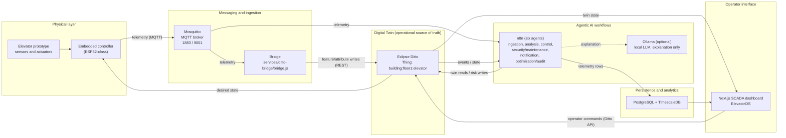
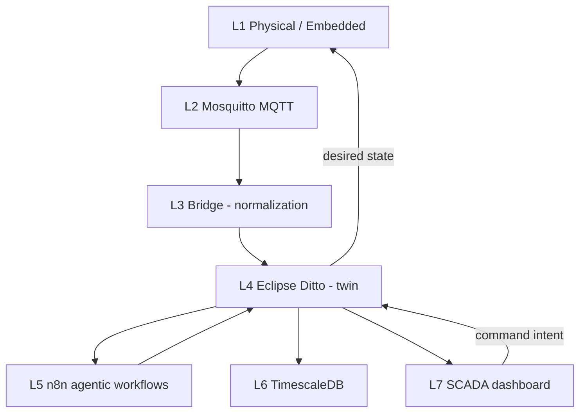
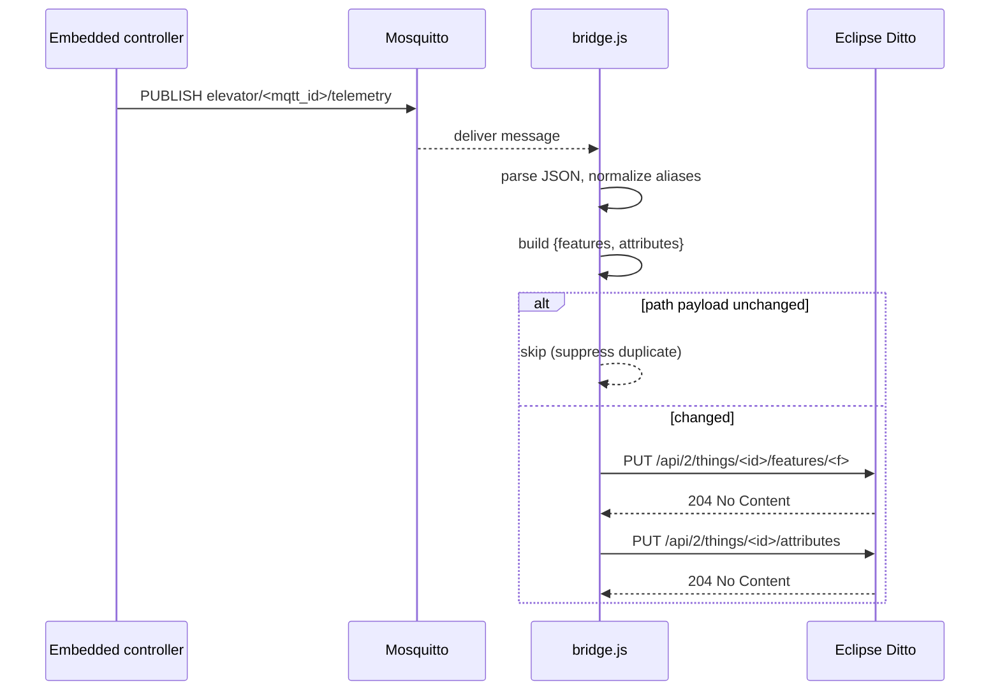
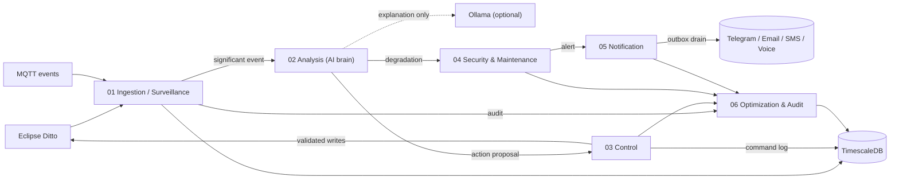
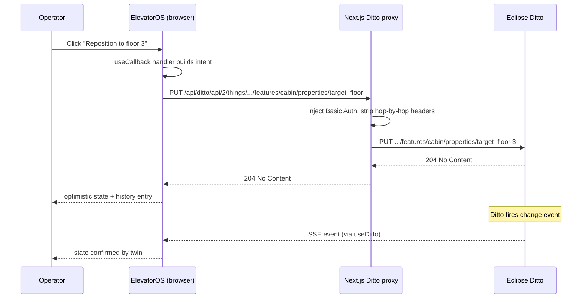
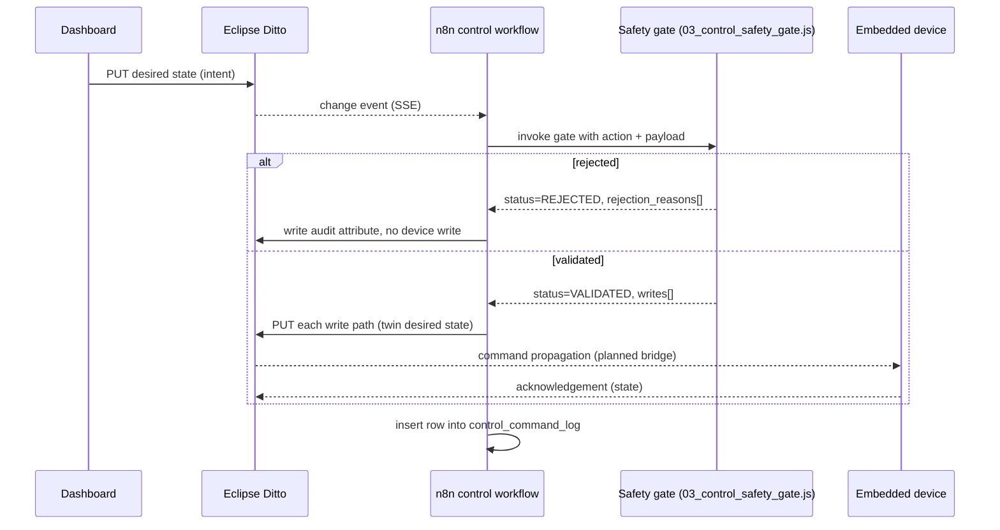

# Chapter 2 — System Architecture and Design

> Companion master-thesis chapter for the project *Agentic AI-Driven Digital Twin
> for Smart and Secure Elevator Management*. The chapter is grounded in the
> repository at `c:\Users\Administrator\smart-elevator-twin` as inspected on
> 2026-05-09. A separate, more implementation-oriented chapter exists at
> [docs/software-design-and-implementation-chapter.md](software-design-and-implementation-chapter.md);
> the present chapter intentionally focuses on architecture and design
> decisions rather than file-by-file implementation walkthroughs.

> **Update note (2026-06-03).** This chapter records the architecture as inspected
> on 2026-05-09. Several surfaces have since advanced; where this chapter's prose
> still describes the earlier state, the following are authoritative:
>
> - **MQTT security is now implemented**, not deferred. Anonymous access is
>   **disabled**; every client authenticates with a username/password and is
>   constrained by `infra/mqtt/aclfile`; the ESP32 ↔ broker hop uses TLS on
>   port 8883 (`infra/mqtt/elevator.conf`). See [SECURITY.md](../SECURITY.md)
>   and the [MQTT reference](mqtt-reference.md). (Supersedes §2.7 / §2.14 / §2.17.)
> - **The command (desired-state) path is now wired end to end.** The dashboard
>   writes command intent to `control/properties/pending_command`; the bridge
>   reconciles it and fans out the MQTT command as the `bridge` identity.
>   (Supersedes the "planned bridge" notes in §2.5 / §2.13.)
> - **The Thing now has 12 features** (adds `microcontroller` and `control`); see
>   the [Ditto twin reference](ditto-twin-reference.md). (Supersedes "ten features".)
> - **An AI-Adaptive Dispatch Policy Engine** (dual-brain champion/challenger) was
>   added; its intent lives at `control/properties/dispatch_policy`. See
>   [features/adaptive-dispatch-engine.md](features/adaptive-dispatch-engine.md).

---

## 2.1 Introduction

The architecture presented in this chapter answers a single engineering
question: *how does a real, sensor-equipped elevator become a queryable,
controllable, observable software system, without compromising the safety
guarantees of the underlying physical machine?* The answer adopted by this
project is a layered Digital Twin platform built around four free, locally
deployable foundations — Eclipse Mosquitto for messaging, Eclipse Ditto for the
twin abstraction, n8n for workflow-based agentic automation, and TimescaleDB
for time-series persistence — interconnected by a Next.js SCADA dashboard that
acts as the operator-facing console.

The design is production-oriented in the sense that every architectural
decision is motivated by concerns that will arise the moment the system is
attached to a real elevator: latency, idempotency, command authority, audit
trails, multi-tenant addressing, and the strict separation between *device
control* and *user interface*. It is *not* a finished industrial product, and
this chapter is candid about which surfaces are demonstrator-quality and which
are ready to be hardened. In particular, the embedded firmware for the
physical elevator prototype is the subject of a dedicated hardware
implementation chapter and is therefore described here only at the
hardware–software interface boundary.

A development utility named `esp32_simulator.py`, together with an
`ELEVATOR_SIMULATOR_ESP8266.ino` sketch, is present in the repository. These
artifacts must be understood as a *development emulator* and *validation
fixture*: they generate Ditto-shaped MQTT envelopes so that the rest of the
stack can be exercised, regression-tested, and demonstrated before the
embedded firmware on the physical prototype is finalized. The architectural
narrative of this chapter treats the physical embedded controller as the
canonical telemetry source. The simulator is mentioned only in the testing
and validation sections.

---

## 2.2 Global System Overview

At the highest level the system is organized as a directed pipeline. Telemetry
flows from the physical elevator through MQTT to the Digital Twin, where it
becomes the authoritative system state. Commands flow in the opposite
direction: an operator interacts with the dashboard, the dashboard expresses
intent against the twin, agentic workflows validate that intent against safety
rules, and only validated intent is propagated back to the device.



Three architectural principles govern the diagram and the rest of the chapter.

1. **Eclipse Ditto is the operational source of truth.** No UI element, agent,
   or automation reads its working state from MQTT. MQTT is the *ingress
   protocol*; Ditto is the *system of record*. This separation means that
   telemetry loss, retransmission, or out-of-order delivery never corrupts the
   user-facing state, and that any subscriber — dashboard, n8n agent, mobile
   app, future BIM integration — sees the same authoritative twin.
2. **Commands are intents against the twin, never direct device pokes.** The
   dashboard never publishes to MQTT command topics. It writes the desired
   state into Ditto features and attributes through the REST API; the n8n
   control agent applies a safety gate; only then does the desired state
   propagate to the device.
3. **Deterministic rules hold safety authority; LLMs only explain.** The n8n
   risk and control agents are pure JavaScript rule engines with explicit
   thresholds, allowlists, and rejection codes. The optional Ollama runtime is
   permitted to *describe* a situation in natural language; it is structurally
   prevented from authorizing or modifying any control decision.

---

## 2.3 Software Requirements

The software requirements were derived from the project's twin objectives —
real-time supervision of a smart elevator and AI-driven prevention of safety,
security, and reliability incidents — and were then constrained by the
practical decision to deploy the entire stack on free, self-hostable
components. They are summarized below using the conventional functional /
non-functional split.

| Class | ID | Requirement | Source / motivation |
|---|---|---|---|
| Functional | FR-01 | Acquire elevator telemetry (motion, door, motor, security, energy) from the embedded controller using JSON over MQTT. | Field instrumentation; cross-vendor interoperability. |
| Functional | FR-02 | Maintain the authoritative elevator state in Eclipse Ditto as a Thing with attributes and twelve features (`cabin`, `door`, `motor`, `security`, `microcontroller`, `incident_log`, `control`, `energy`, `performance`, `predicted_failures`, `ai_analysis`, `maintenance_schedule`). | Twin abstraction; consistent state surface for all consumers. |
| Functional | FR-03 | Provide a web SCADA dashboard that visualizes live and historical state and exposes operator commands. | Operator supervision and control. |
| Functional | FR-04 | Route operator commands through Ditto and a deterministic safety gate before any device-side application. | Safety, audit, and human-in-the-loop control. |
| Functional | FR-05 | Persist telemetry, audit, command, work-order, and notification records in TimescaleDB for at-rest analytics. | Compliance and post-incident analysis. |
| Functional | FR-06 | Compute risk, predict maintenance needs, dispatch notifications, and audit decisions through n8n agents. | Agentic automation. |
| Non-functional | NFR-01 | Update SCADA visualizations within roughly one elevator tick (target ≤ 3 s end-to-end at the current simulator cadence). | Operator perception. |
| Non-functional | NFR-02 | Survive transient broker, bridge, or Ditto outages without operator intervention. | Reliability. |
| Non-functional | NFR-03 | Support multi-elevator and multi-building deployments without code changes, only through configuration of `thing_id`, `correlation_id`, and fleet identifiers. | Scalability. |
| Non-functional | NFR-04 | Deploy as a single `docker compose up` on commodity hardware, with no paid SaaS dependency. | Reproducibility, thesis context. |
| Non-functional | NFR-05 | Expose every cross-component interaction through a documented protocol (MQTT topics, REST paths, SQL tables, n8n webhooks). | Maintainability. |
| Constraint | C-01 | Eclipse Ditto runs as an external Compose stack reachable through the shared `docker_default` Docker network. | The Ditto distribution is not vendored into this repository. |
| Constraint | C-02 | The Mosquitto broker exposes MQTT over TCP `1883` and WebSocket `9001`. | Browser dashboard requires WS. |
| Constraint | C-03 | Local-development credentials and anonymous MQTT are acceptable in-repo defaults; production deployment requires explicit hardening (Section 2.14). | Demonstrator scope. |

These requirements, together, dictate the layered architecture described in
the next section.

---

## 2.4 General Layered Architecture

The system is organized into seven cooperating layers. Each layer has a single
responsibility, exposes a contract to the layer above, and treats the layers
below as black boxes accessible only through that contract. This is a
deliberate choice: it allows any layer to be replaced — the simulator with
real firmware, Mosquitto with EMQX, Ditto with another twin engine, n8n with
a bespoke agent runtime, the dashboard with a mobile client — without rewriting
the rest of the system.

| # | Layer | Primary responsibility | Representative artefacts | External contract |
|---|---|---|---|---|
| L1 | Physical and embedded acquisition | Sense, actuate, debounce, time-stamp | Sensors, ESP32 firmware, `ELEVATOR_SIMULATOR_ESP8266.ino` (validation only) | Ditto-shaped JSON envelope on MQTT |
| L2 | Communication / messaging | Transport, fan-out, durability | Mosquitto, topic conventions | MQTT 3.1.1 over TCP and WS |
| L3 | Bridge and normalization | Schema unification, alias resolution, idempotent twin writes | `services/ditto-bridge/bridge.js` | Ditto REST `PUT /api/2/things/...` |
| L4 | Digital Twin | Authoritative state, addressability, policy, eventing | Eclipse Ditto, `scripts/init-ditto.sh`, `scripts/init-ditto.ps1` | HTTP API + Ditto SSE |
| L5 | Agentic automation | Risk, control, security, maintenance, notification, audit, optimization | `workflows/n8n/*.json` and `enterprise-upgrade-code/*.js` | Webhooks + Ditto API + Postgres |
| L6 | Persistence and analytics | History, aggregation, audit, outbox | TimescaleDB hypertables and continuous aggregates | SQL |
| L7 | Operator interface | Visualization and command intent | `apps/dashboard/app/page.tsx` rendering `apps/dashboard/components/ElevatorOS.jsx` | Browser HTTP/WS, Ditto proxy |

The ordering is intentional: information flows L1 → L4 by default, then fans
out from L4 to L5, L6, and L7 in parallel; commands flow L7 → L4 → L5 → L4
→ L1, never bypassing L4 or L5. The remainder of the chapter is structured
around these layers.



---

## 2.5 Hardware–Software Interaction

The hardware–software boundary is intentionally narrow: the embedded firmware
exposes telemetry and accepts desired-state commands through MQTT, and nothing
else. Choosing a single boundary protocol — and making that protocol equally
valid for a real ESP32, the Python validation utility, and the Arduino
embedded sketch — means the software stack does not need to know whether it
is observing a real cabin, a hardware-in-the-loop rig, or a regression
fixture. Three concerns shape this boundary.

**Telemetry envelope.** The embedded controller publishes Ditto-shaped JSON
messages to topic `elevator/telemetry/<thing_id>`. The bridge accepts both
the canonical Ditto path envelope (`{"topic": "...", "path":
"/features/cabin/properties/...", "value": ...}`) and a flatter form keyed
by feature name. The presence of the dual format is documented in
`bridge.js` (see `normalizeDittoPathEnvelope` and `normalizeTelemetry`) and
is what makes the interface tolerant to firmware that has not yet been
finalized. As a future-work item the topic convention should be unified to
`elevator/<thing_id>/telemetry`, which more cleanly supports per-device
authorization rules.

**Desired-state propagation.** The reverse path — Ditto-to-device — is
*architecturally specified but not yet wired in the open-source bridge*.
The intended mechanism is a Ditto connection (or a dedicated subscriber
process) that translates desired-state changes on
`features/cabin/properties/target_floor`, `features/door/properties/...`,
`features/fire_safety/properties/recall_active` and similar paths into
MQTT command topics consumed by the embedded controller. Until the
embedded firmware is integrated, the dashboard's command path terminates
at the twin, which is sufficient to validate the entire
intent-to-validation-to-twin sub-chain.

**Time and identity.** Every telemetry sample carries an implicit identity
(its MQTT topic and embedded `thingId`) and an explicit acquisition time
once it enters TimescaleDB. The embedded layer is not required to provide
correlation identifiers; those are minted by ingestion (Section 2.11)
because correlation IDs are a backend audit concern, not a sensor concern.

The architectural posture, in summary, is that the embedded layer is a *thin
producer of facts and consumer of orders*. All semantics — what counts as an
incident, what risk score a vibration value implies, when an operator may
clear a lockdown — live in the layers above.

---

## 2.6 Embedded Data Acquisition Layer

The embedded layer is responsible for sensing, debouncing, and serializing
elevator state at a cadence sufficient for supervision (target ≈ 1 Hz to
3 Hz). The physical prototype is built around an ESP32-class controller
attached to motion (encoder or hall-effect), door position, motor current,
vibration, RFID, and emergency-stop subsystems. Detailed pinouts, sampling
strategies, and firmware are deferred to the hardware chapter.

For software-architecture purposes, the embedded layer must satisfy three
contracts:

1. **Schema fidelity.** Each sample serializes a subset of the canonical
   feature tree provisioned by the Ditto initialization scripts —
   `cabin`, `door`, `motor`, `security`, `incident_log`, `energy`,
   `performance`. Field names follow snake_case (e.g. `current_floor`,
   `vibration_level`, `temperature_c`). The bridge tolerates camelCase and
   a handful of legacy aliases (e.g. `payload_weight_kg → load_kg`,
   `vibration_g → vibration_level`), but firmware should target the
   canonical names to keep the alias table small.
2. **Idempotent re-publication.** The embedded controller is permitted (and
   in fact encouraged) to republish unchanged telemetry on every tick,
   because the bridge suppresses unchanged Ditto writes per path.
   Idempotent publishing simplifies the firmware (no diffing logic) without
   penalising the twin.
3. **Local safety remains local.** Whatever software safety the controller
   implements (mechanical interlocks, brake assertions on watchdog timeout,
   door-blocking on overload) is *the* safety layer. The agentic workflows
   add a second software gate; they do not replace the device-side gate.

Two artefacts in the repository serve as *validation* surfaces for the
embedded contract while real firmware is being developed: `esp32_simulator.py`
(a Python state-machine that publishes Ditto envelopes through Paho MQTT)
and `ELEVATOR_SIMULATOR_ESP8266/ELEVATOR_SIMULATOR_ESP8266.ino` (an Arduino
sketch following the same payload convention). They are described in
Section 2.16; for the purposes of architecture they are placeholder
producers, not the canonical source.

---

## 2.7 Communication and Messaging Layer

MQTT was selected as the field-to-backend transport for the same reasons it
dominates industrial IoT: a tiny per-message overhead, a mature publish /
subscribe semantic that decouples producers from consumers, native support
for unreliable links through QoS 1 / 2 and last-will-and-testament, and
broad embedded support. Mosquitto was chosen as the broker because it is
free, written in C, runs in roughly fifteen megabytes of memory, and
exposes both a TCP listener and a WebSocket listener — the latter being a
hard requirement for any in-browser MQTT client that the dashboard might
need.

The active Mosquitto configuration is `infra/mqtt/elevator.conf`. It is
**authenticated and ACL-enforced**, with TLS on the ESP32-facing listener
(the original `allow_anonymous true` development config has been superseded —
see the update note above and [SECURITY.md](../SECURITY.md)):

```conf
allow_anonymous false
password_file /mosquitto/config/passwordfile
acl_file /mosquitto/config/aclfile

listener 1883            # plaintext, intra-Docker only (auth + ACL still enforced)
protocol mqtt

listener 9001            # WebSockets for the browser dashboard (auth + ACL)
protocol websockets

listener 8883            # TLS for the ESP32 over WiFi (server-only TLS, CA pinned in firmware)
protocol mqtt
cafile   /mosquitto/config/certs/ca.crt
certfile /mosquitto/config/certs/server.crt
keyfile  /mosquitto/config/certs/server.key
tls_version tlsv1.2
require_certificate false
```

The Compose service in `docker-compose.yml` mounts the whole config directory at
`/mosquitto/config` (read-only), points the broker at `elevator.conf`, opens the
three listener ports (1883/8883/9001), declares an authenticated
`mosquitto_pub`-based health check (the `healthcheck` ACL user), and joins both
the project's default network and the external `ditto_network`.

**Topic conventions.** The project standardises on a single canonical
topic pattern:

```
elevator/{mqtt_safe_thing_id}/{telemetry|events|commands|status}
```

The Ditto Thing ID (e.g. `building:floor1:elevator`) is preserved
unchanged at the twin layer; inside MQTT topic strings we use the safe
form `building-floor1-elevator` so that segment names do not collide
with the `:` namespace separator that complicates wildcard ACLs. The
mapping is implemented by `thing_id_to_mqtt_id()` / `mqtt_id_to_thing_id()`
helpers in both the Python simulator (`esp32_simulator.py`) and the
Node bridge (`services/ditto-bridge/bridge.js`).

| Topic | Direction | Used by |
|---|---|---|
| `elevator/<mqtt_id>/telemetry` | Device -> cloud | Simulator / ESP firmware publish, bridge subscribe (`elevator/+/telemetry`) |
| `elevator/<mqtt_id>/events` | Device -> cloud | Discrete safety / maintenance events |
| `elevator/<mqtt_id>/commands` | Cloud -> device | Dashboard command publish, device subscribe |
| `elevator/<mqtt_id>/status` | Device -> cloud | Heartbeat / online-offline status |

The legacy patterns `elevator/telemetry/{id}`, `elevator/telemetry/+`,
and `elevator/telemetry/#` are deprecated. The bridge still accepts an
override via `MQTT_TOPIC` for backwards compatibility, but the
canonical default in `.env.example` and `docker-compose.yml` is now the
fleet-wide subscription set above.

**Quality of Service.** The current configuration relies on QoS 0 ("at most
once"), which is appropriate for high-frequency telemetry whose loss is
masked by the next tick and by the bridge's idempotent writes. For event
topics — security breaches, maintenance escalations, command
acknowledgements — QoS 1 with broker-side persistence should be enabled
once authentication is in place.

---

## 2.8 Digital Twin Layer

The Digital Twin layer turns a stream of MQTT facts into a structured,
addressable, queryable representation of the elevator. Eclipse Ditto, an
Eclipse Foundation project for digital twin management, was selected for
four converging reasons: it is free and self-hostable; it natively models
devices as *Things* with *features* and *attributes*; it exposes a HTTP and
WebSocket API as well as Server-Sent Events, which fits both backend
synchronization and browser SSE consumption; and its policy system permits
fine-grained authorization, which is the foundation on which a future
multi-tenant deployment can be built.

**Thing model.** The provisioned Thing is identified as
`building:floor1:elevator` (configurable via `PRIMARY_THING_ID`). Its
attributes describe slowly-varying or device-identity information
(`location`, `manufacturer`, `model`, `serialNumber`); its features
decompose the elevator into twelve subsystems whose properties are written
independently. The class diagram below shows the original ten telemetry/analysis
features; the current scripts also provision `microcontroller` (ESP32 presence)
and `control` (command intent + dispatch policy) — see the
[Ditto twin reference](ditto-twin-reference.md#5-features) for the full surface.
The `scripts/init-ditto.sh` script provisions the Thing idempotently:

```mermaid
classDiagram
    class Thing {
      +String thingId = "building:floor1:elevator"
      +String policyId
      +Map attributes
      +Map features
    }
    class Attributes {
      +String location
      +String manufacturer
      +String model
      +String serialNumber
    }
    class FeatureCabin {
      +int current_floor
      +int target_floor
      +String direction
      +float load_kg
      +float temperature_c
      +float speed_ms
      +bool emergency_stop
    }
    class FeatureDoor {
      +String state
      +bool door_forced_entry
    }
    class FeatureMotor {
      +float vibration_level
      +float hours_operated
      +String health_status
      +float temperature_c
    }
    class FeatureSecurity {
      +bool audio_distress_active
      +int unauthorized_access_attempts
      +String rfid_last_card
      +bool rfid_access_granted
      +String alert_level
    }
    class FeatureIncidentLog {
      +Array entries
      +int open_incidents
    }
    class FeatureEnergy {
      +float kwh_today
      +float kwh_month
      +float kwh_baseline
      +float co2_kg
      +float regen_kwh
    }
    class FeaturePerformance {
      +float avg_wait_s
      +float avg_trip_s
      +float availability_pct
      +float door_cycle_efficiency
    }
    class FeaturePredictedFailures {
      +int bearing_days
      +int door_motor_days
      +int brake_days
      +int overall_risk
    }
    class FeatureAiAnalysis {
      +DateTime last_analysis_at
      +int risk_score
      +String risk_label
      +String summary
      +Array recommended_actions
    }
    class FeatureMaintenanceSchedule {
      +DateTime next_service_date
      +DateTime last_service_date
      +int open_work_orders
      +String priority
    }
    Thing *-- Attributes
    Thing *-- FeatureCabin
    Thing *-- FeatureDoor
    Thing *-- FeatureMotor
    Thing *-- FeatureSecurity
    Thing *-- FeatureIncidentLog
    Thing *-- FeatureEnergy
    Thing *-- FeaturePerformance
    Thing *-- FeaturePredictedFailures
    Thing *-- FeatureAiAnalysis
    Thing *-- FeatureMaintenanceSchedule
```



**Why ten features and not one big object?** The decomposition mirrors the
*physical and concern* boundaries of the system. The bridge writes only the
features that changed; agents subscribe to the subset they care about
(security agents read `security` and `door`; maintenance agents read
`motor`, `energy`, and `predicted_failures`); operators see badges grouped
by subsystem. An undifferentiated state object would force every consumer
to re-parse the entire elevator on every change.

**Policy.** The `init-ditto.sh` script also provisions a policy that grants
the configured Ditto user (default `nginx:ditto`) READ/WRITE access to
the Thing, the policy itself, and message resources. This is
demonstrator-grade and should be replaced, in production, with a policy
that distinguishes operator, maintenance, security, and audit roles, and
that grants per-feature permissions (an operator may write `cabin/target_floor`
but not `motor/health_status`; a security agent may write `security` but
not `cabin`).

**Eventing.** Ditto natively emits change events on its `/things` namespace
through Server-Sent Events. The dashboard's `useDitto.js` hook supports SSE
when enabled, and falls back to REST polling otherwise, with a heartbeat
guard against frozen state (Section 2.12). On the n8n side the ingestion
agent currently *polls* Ditto on a 5-second schedule — a deliberate
simplification that keeps the workflow purely reactive to schedule events
rather than to push events. Migrating ingestion to SSE-driven webhooks is
listed in the future work (Section 2.17).

**External deployment.** The Ditto stack itself is *not* defined in this
project's `docker-compose.yml`. The Compose file declares `ditto_network`
as an external network (`docker_default`) and addresses Ditto through
`http://docker-nginx-1` from inside the network and through
`http://localhost:8080` from the host. Ditto is therefore an *operational
dependency* of this project, not a vendored component, and its lifecycle is
managed by the operator running `docker compose up -d` in the Ditto
distribution before bringing this stack online.

---

## 2.9 Backend, Bridge, and API Layer

The backend layer mediates between MQTT and Ditto, and between the browser
and Ditto. It comprises three artefacts: the Node bridge process, the
Next.js Ditto proxy route, and the historical-data API routes.

### 2.9.1 The MQTT-to-Ditto bridge

The bridge in `services/ditto-bridge/bridge.js` is a single-process Node
service that subscribes to the configured MQTT topics, normalizes the
incoming payloads, and writes the result to Ditto through the REST API.
Its design exhibits four properties that are non-negotiable for an
industrial-style ingestion path.

*Schema tolerance with normalization.* The bridge accepts three payload
shapes — the canonical Ditto envelope `{topic, path, value}` (handled by
`normalizeDittoPathEnvelope`), a flat `{features, attributes}` patch, and
a per-feature flat object — and reduces all three to the same internal
form. Property aliases (`vibration_g → vibration_level`,
`audio_distress_detected → audio_distress_active`,
`unauthorized_access_count → unauthorized_access_attempts`) are
resolved by `applyPropertyAliases` so that downstream consumers never see
more than one name for the same fact.

*Suppression of unchanged writes.* A `lastSerializedByPath` map records
the last serialized payload written to each Ditto path. If a new write
would produce the same JSON, the bridge returns `"skipped"` instead of
contacting Ditto. This single optimization eliminates the majority of
twin writes during steady-state operation, which is essential when the
embedded controller publishes at 1 Hz indefinitely.

*Bounded retries with backoff.* `putWithRetry` retries each Ditto write
up to three times with linearly increasing delays
(`DITTO_RETRY_DELAY_MS * attempt`). The final exception is propagated and
logged, but the bridge does not crash on isolated Ditto failures — a
fragility that would otherwise cascade through the operator interface.

*Latest-only queueing.* The bridge maintains a single
`latestTelemetry` slot rather than an unbounded queue. Bursty publishers
can outrun Ditto without producing memory growth because only the most
recent message survives. For an elevator this is the correct policy: an
out-of-date floor reading is worse than a missed intermediate one.



### 2.9.2 The Next.js Ditto proxy

The browser cannot talk to Ditto directly without exposing credentials and
without dealing with CORS. The dashboard therefore routes all Ditto traffic
through `apps/dashboard/app/api/ditto/[...path]/route.ts`, a catch-all Next.js
Route Handler that injects HTTP Basic Auth from server-side environment
variables, strips hop-by-hop headers, distinguishes ordinary REST requests
from `text/event-stream` SSE requests (treating the timeout as a
connect-only guard for the latter), and translates upstream errors into
structured 502 / 503 / 504 responses. The proxy is the *only* point at
which Ditto credentials are read from the environment; no browser-side
code holds them, save for the legacy `NEXT_PUBLIC_*` fallback variables
that should be removed before production.

### 2.9.3 Historical data routes

A second family of API routes under `apps/dashboard/app/api/history/*`
(`audit`, `commands`, `energy`, `maintenance`, `notifications`, `risk`,
`summary`, `system-health`, `telemetry`) reads from TimescaleDB and serves
aggregated history to the dashboard. These routes are the read-side
counterpart to the n8n agents' write-side: agents persist, the API reads.

---

## 2.10 Database and Historical Storage Layer

Telemetry, audit records, control commands, work orders, notifications, and
system-health checks are persisted in a single TimescaleDB instance running
on PostgreSQL 15 (`timescale/timescaledb:latest-pg15`). The schema is
established by `infra/postgres/init/001_timescaledb.sql` and extended by
idempotent migrations (`infra/postgres/migrations/002_…`, `003_…`, `004_…`).

The schema decomposes into three logical groups.

| Group | Tables | Purpose |
|---|---|---|
| Telemetry | `telemetry_raw` (hypertable) | Time-series of every ingested event with denormalized hot fields and the original payload as JSONB. |
| Operational records | `audit_log`, `notification_outbox`, `agent_state`, `control_command_log`, `maintenance_work_orders`, `system_health_history` | Workflow execution traces, reliable notification dispatch, agent checkpoints, command lifecycle, predictive maintenance, periodic health probes. |
| Continuous aggregates and views | `hourly_risk`, `hourly_energy`, `active_elevator_incidents` | TimescaleDB materialized views and a helper view for dashboard summaries. |

Five design choices deserve emphasis.

**Hypertable for telemetry.** `telemetry_raw` is converted to a TimescaleDB
hypertable on the `time` column. The hypertable partitions data by time,
which is essential at the cadence and retention this system targets, and
unlocks `time_bucket` continuous aggregates without bespoke ETL.

**Hot fields plus JSONB.** Every telemetry row carries denormalized
*hot fields* (`current_floor`, `load_kg`, `motor_temp_c`, `vibration_g`,
`risk_score`) and the full original payload as `raw_payload jsonb`. The
hot fields support indexed queries and continuous aggregates; the JSONB
payload preserves forensic completeness for incidents whose root cause
turns out to involve a field nobody thought to denormalize.

**Correlation identifiers everywhere.** The 002 migration adds
`correlation_id` to telemetry, audit, notification outbox, command log,
work orders, and health history. A correlation ID is minted at ingestion
and propagated through every workflow it triggers; the result is that a
single SQL `WHERE correlation_id = ...` reconstructs the complete
ingestion → analysis → control → notification → audit chain for any
incident.

**Outbox-with-deduplication for notifications.** `notification_outbox` is
a classical outbox table with a `dedupe_key UNIQUE` index, a `priority`
column, retry counters, and an `escalation_level`. The notification agent
writes intents into this table; a separate drain workflow attempts
delivery, increments retries on failure, and escalates after configured
thresholds. The outbox decouples *deciding to notify* from *actually
delivering* — a separation that survives broker outages and recipient
unavailability.

**Continuous aggregates for cheap dashboards.** `hourly_risk` and
`hourly_energy` are TimescaleDB *continuous aggregates* — incrementally
maintained materialized views that the dashboard can query in milliseconds
even over months of data. The `active_elevator_incidents` view fuses the
last 24 h of telemetry into a per-thing summary used by the alerts page.

A secondary persistence path exists in the form of `runtime/live-twin.json`,
a snapshot file written by the Python validation utility for local
debugging; it is not part of the production data path.

---

## 2.11 Agentic AI and Workflow Automation Layer

Agentic automation is implemented in n8n, a free, self-hostable workflow
runtime. The repository ships six exported workflows under
`workflows/n8n/`, each representing a single agent with a single
responsibility. Each agent's logic is implemented in JavaScript Code nodes
whose source is also vendored separately under
`workflows/n8n/enterprise-upgrade-code/` for code review and testing.

| # | Workflow | Trigger | Mandate |
|---|---|---|---|
| 01 | Ingestion / surveillance | Schedule (every 5 s, polling Ditto) + MQTT events | Canonicalize twin events, deduplicate, persist telemetry rows, route significant events to analysis and audit. |
| 02 | Analysis (AI brain) | Webhook from 01 | Compute deterministic risk score, optionally call Ollama for *explanation only*, route actions to control or maintenance. |
| 03 | Control | Webhook from 02 (or human approval flow) | Apply the safety gate, generate Ditto write list, log to `control_command_log`. |
| 04 | Security and maintenance | Schedule + webhooks | Detect repeated RFID failures, forced entry, audio distress, vibration drift, motor heat; raise alerts and create work orders. |
| 05 | Notification | Webhook + scheduled outbox drain | Materialize outbox rows, dispatch to enabled channels (Telegram/email/SMS/voice), retry with backoff. |
| 06 | Optimization and audit | Schedule + audit webhook | Predictive dispatch, energy optimization, compliance/audit normalization. |



Three architectural commitments shape this layer.

**Deterministic rules hold authority.** Every safety-critical decision —
risk score computation, command admissibility, work-order creation — is
made by a pure JavaScript Code node with explicit thresholds. The risk
engine in `02_deterministic_risk_engine.js` weighs inputs such as
forced-entry events, audio distress, repeated RFID failures, vibration
ratio against baseline, motor temperature, load ratio, emergency stop,
door-open movement, current draw, power, door-cycle fatigue, and service
hours. The control safety gate in `03_control_safety_gate.js` validates an
allowlist of twelve commands (`EMERGENCY_STOP`, `LOCKDOWN`, `REPOSITION`,
`RESTRICT_LOAD`, `MAINTENANCE_MODE`, `RESUME_NORMAL`,
`FIRE_RECALL_TO_GROUND`, `DOOR_HOLD_OPEN`, `DOOR_CLOSE_SAFE`,
`SET_ENERGY_SAVING_MODE`, `CLEAR_SECURITY_ALERT`, `ACKNOWLEDGE_INCIDENT`)
and emits explicit rejection codes (e.g. `MOVEMENT_BLOCKED_LOCKDOWN`,
`TARGET_FLOOR_OUT_OF_RANGE`, `AUTO_CONTROL_REQUIRES_HUMAN_APPROVAL`,
`RESUME_REQUIRES_HUMAN_CLEARANCE`).

**LLMs explain, never authorize.** The optional Ollama integration runs
locally and is invoked only by the analysis agent's
`02_ollama_context_analyzer.js` node. The result of the LLM call enters
the workflow as text under `ai_analysis.summary` and never as a numeric
score, never as a command, and never as a policy decision. This is a
structural guarantee, not a convention: the control gate's input is the
output of the deterministic engine, not the LLM.

**Multi-tenant by configuration.** Every agent reads `PRIMARY_THING_ID`
and `ELEVATOR_FLEET_IDS` from the environment, mints a `correlation_id`
per ingested event, and addresses Ditto and Postgres by `thing_id`. There
is no hard-coded reference to `building:floor1:elevator` in the agent
logic. Adding a second elevator amounts to provisioning a second Ditto
Thing, configuring its embedded controller, adding its identifier to
`ELEVATOR_FLEET_IDS`, and re-importing the workflows.

---

## 2.12 Web Dashboard and SCADA Supervision Interface

The operator-facing surface is a Next.js application using React 18,
Tailwind CSS, Recharts, and a local component library. The active route
is `apps/dashboard/app/page.tsx`, which renders `apps/dashboard/components/ElevatorOS.jsx`
— a single composite component that hosts the digital twin view, the
monitoring page, the control panel, the analytics page, the alerts and
logs pages, the devices and sensors view, the reports page, the settings
page, and a help/about screen. Reusable building blocks — primitives,
panels, charts — live under `apps/dashboard/components/scada` and `components/ui`.

**State acquisition.** The dashboard never reads from MQTT for its
authoritative state; it reads from Ditto. This is implemented by the
`useDitto` hook (`apps/dashboard/src/hooks/useDitto.js`), which prefers Ditto
Server-Sent Events when `NEXT_PUBLIC_DITTO_SSE_ENABLED` is true and falls
back to REST polling at a configurable interval otherwise. Even when SSE
is connected, a low-frequency heartbeat poll guards against silently
broken streams. A separate `useMqtt` hook is available to surface live
MQTT messages for diagnostic panels (the *Devices / Sensors* view), but
the visualisations in *Digital Twin*, *Monitoring*, *Analytics*, and
*Alerts* read exclusively from the Ditto-backed state.

**Command issuance.** Operator commands — emergency stop, lockdown,
maintenance mode, resume, target-floor reposition, fire recall — are
expressed by writing to Ditto features and attributes through the
`dittoApi` service (`apps/dashboard/src/services/dittoApi.js`), which goes
through the proxy route described in Section 2.9.2. The dashboard
*intentionally* does not publish to MQTT command topics, because doing so
would bypass the n8n control safety gate and the audit trail. Local
simulation injectors (high vibration, forced entry, audio distress,
invalid RFID) exist for demonstration and are guarded so that they are
disabled while live MQTT or Ditto data is flowing.

**Pages and their responsibilities.**

| Page | Source of state | Responsibility |
|---|---|---|
| Digital Twin | Ditto | Live visualization of cabin, door, motor, security, energy, performance features. |
| Monitoring | Ditto + MQTT | Charts of vibration, temperature, load, energy; connection state badges. |
| Control Panel | Ditto API | Operator commands; simulator-only injectors (guarded). |
| Analytics | TimescaleDB via `/api/history` | Risk distribution, energy efficiency, predictive indicators. |
| Alerts | Ditto + Postgres `active_elevator_incidents` | Active critical and warning conditions. |
| Logs | Postgres `audit_log`, `control_command_log` | Combined command, telemetry, incident history. |
| Devices / Sensors | MQTT, Ditto | Topic hierarchy, ESP controller status, twin sync state. |
| Reports | Postgres aggregates | Periodic summaries of motor health, security, energy. |
| Settings | Browser storage | Theme, profile, preferences. |
| Help / About | Static | System overview for operators. |



---

## 2.13 Command and Control Design

Command and control is the most safety-sensitive surface of the system, and
its design is therefore the most defensive. Five rules govern every
control path.

1. **No direct MQTT control from the UI.** The dashboard expresses *intent*
   against the twin, not actions against the device. An operator clicking
   *Emergency Stop* triggers a `PUT` against
   `features/cabin/properties/emergency_stop`, never a publish to
   `elevator/<id>/cmd`.
2. **Every command carries a correlation context.** A command has a
   `command_id`, a `correlation_id`, a `requested_by` principal, a
   `source_agent`, a non-empty `reason` array, and a `risk_score`. The
   safety gate rejects commands missing any of these with explicit
   codes (`MISSING_THING_ID`, `MISSING_CORRELATION_ID`,
   `MISSING_SOURCE_AGENT`, `MISSING_REASON`). This guarantees that every
   downstream audit row can be traced.
3. **Allowlist, not blocklist.** Only the twelve commands enumerated in
   Section 2.11 are accepted. Any other command — even if syntactically
   valid for Ditto — is rejected as `UNSUPPORTED_COMMAND`.
4. **Stateful guards.** Movement commands (`REPOSITION`,
   `FIRE_RECALL_TO_GROUND`) are blocked while the system is in
   `LOCKDOWN` or while `cabin.emergency_stop` is asserted. Target floors
   are bounded by `MIN_FLOOR` and `MAX_FLOOR`. `RESUME_NORMAL` is
   rejected with `RESUME_REQUIRES_HUMAN_CLEARANCE` if there is an
   unresolved critical security incident, an unresolved critical
   maintenance issue, or a CRITICAL risk severity, *unless* a human
   approver is explicitly attached.
5. **Risk-weighted human-in-the-loop.** Any command issued under a
   risk score at or above `MAX_RISK_AUTO_CONTROL` (default 85) and not
   marked `human_approved` is rejected with
   `AUTO_CONTROL_REQUIRES_HUMAN_APPROVAL`, with the explicit exception
   of safety-critical commands (`EMERGENCY_STOP`, `LOCKDOWN`,
   `FIRE_RECALL_TO_GROUND`) which may always proceed because their
   purpose is precisely to react to high risk.



The control command log captures the lifecycle (`status`, `created_at`,
`executed_at`, `acknowledged_at`, `error_message`), the command body
(`command`, `value`, `ditto_path`), and the contextual provenance
(`correlation_id`, `requested_by`, `source_agent`, `reason`,
`risk_score`). A unique index on `command_id` guarantees idempotency for
redelivered webhooks.

---

## 2.14 Security and Reliability Considerations

The current configuration is honest about the difference between *correct
shape* and *production-ready hardening*. The shape is correct — credentials
are kept server-side in the proxy, commands traverse a safety gate, the
notification path uses an outbox with deduplication, audit is per-action.
The hardening is partial. The table below summarizes both.

| Surface | Current (in-repo) | Production hardening |
|---|---|---|
| MQTT broker | Anonymous on TCP 1883 / WS 9001. | Per-device username/password or X.509 client certificates; topic ACLs per `thing_id`; TLS on both listeners. |
| Embedded provisioning | Validation sketch hardcodes Wi-Fi/broker. | Provisioned credentials in NVS; rotating device certificates. |
| Ditto credentials | Read from server env in the proxy; `NEXT_PUBLIC_*` fallback values exist. | Remove `NEXT_PUBLIC_*` fallbacks; use a secret manager; per-role Ditto users. |
| Ditto policy | Single owner with READ/WRITE on all resources. | Role-separated policies (operator, maintenance, security, audit) with feature-level grants. |
| Dashboard auth | Local browser session (frontend only). | OIDC with a self-hosted IdP (e.g. Keycloak); server-side session; RBAC bound to Ditto policy roles. |
| n8n credentials | Re-attached after import; basic in-app credential store. | External secret manager; n8n instance behind reverse proxy with mTLS; restricted webhook surface. |
| Notification channels | Webhooks for Telegram/email/SMS/voice (off by default). | Dedicated outbound proxy; per-channel rate limits; channel-specific signing. |
| Audit retention | TimescaleDB hypertable, no policy. | Retention and compression policies on hypertables; off-site WAL archival; tamper-evident audit chain. |

Reliability is addressed by four mechanisms that are present today.

1. The bridge retries with backoff and suppresses unchanged writes.
2. The dashboard polls Ditto as a fallback to SSE and uses a heartbeat
   even when SSE is connected.
3. The notification outbox guarantees at-least-once delivery with
   deduplication.
4. The TimescaleDB schema is fully idempotent through `IF NOT EXISTS`
   clauses, allowing safe re-execution of every migration.

The remaining reliability work is to introduce broker QoS 1 with persistent
sessions for event topics, to formalize the device-acknowledgement loop on
the desired-state path, and to add integration tests that exercise the
ingestion → twin → analysis → control → notification chain end-to-end with
deliberate fault injection.

---

## 2.15 Deployment Architecture

The deployment topology is a single-host Docker Compose stack that
attaches to an external Eclipse Ditto stack through a shared Docker
network. This is the correct topology for thesis-scale demonstration and
single-building pilot deployment. It is also the substrate on which a
multi-elevator or multi-building deployment can be built without
architectural change — only by configuration.

```mermaid
flowchart TB
    subgraph Host["Single Linux/Windows host (or laptop)"]
        subgraph DittoStack["External docker-compose stack: Eclipse Ditto"]
            NG["docker-nginx-1<br/>(reverse proxy)"]
            DTService["Ditto microservices"]
            NG --- DTService
        end
        subgraph ProjectStack["docker-compose.yml (this repository)"]
            MQ["elevator-mqtt<br/>(Mosquitto)"]
            BR["elevator_bridge<br/>(Node)"]
            SIM["elevator_simulator<br/>(validation only)"]
            N8N["elevator_agents<br/>(n8n)"]
            PG["elevator_db<br/>(TimescaleDB/PostgreSQL)"]
            OL["elevator_ollama<br/>(profile: ai)"]
            ADM["elevator_adminer<br/>(profile: tools)"]
            GR["elevator_grafana<br/>(profile: observability)"]
        end
        subgraph HostProcs["Host processes"]
            UI["Next.js dev/prod server<br/>(dashboard)"]
        end
    end

    subgraph DockerNet["Docker network: docker_default (external)"]
        MQ --- DockerNet
        BR --- DockerNet
        N8N --- DockerNet
        PG --- DockerNet
        OL --- DockerNet
        ADM --- DockerNet
        GR --- DockerNet
        DTService --- DockerNet
    end

    UI --HTTP--> NG
    UI --WebSocket--> MQ
    BR --MQTT--> MQ
    BR --HTTP--> NG
    N8N --HTTP--> NG
    N8N --SQL--> PG
```

**Service inventory.** The repository's Compose file declares seven
services. Three (`mosquitto`, `bridge`, `simulator`) form the field-side
ingestion path; one (`n8n`) is the agent runtime; one (`postgres`) is the
data plane; two (`ollama`, `adminer`, `grafana` — under named profiles)
are optional accessories. Resource limits and reservations are set on
each service. The `bridge` runs read-only with a tmpfs at `/tmp` and at
`/app/node_modules/.cache`. All services run with `no-new-privileges`.

**Configuration surface.** The Compose file consumes roughly forty
environment variables, the most important of which are
`PRIMARY_THING_ID` (the canonical Thing identifier),
`ELEVATOR_FLEET_IDS` (the comma-separated fleet roster used by the agent
workflows), `DITTO_BASE_URL` and `DITTO_PUBLIC_BASE_URL` (the in-network
and host-visible Ditto URLs), `MAX_RISK_AUTO_CONTROL` (the human-approval
threshold of the control gate), and the per-channel toggle/credential
variables for notifications. The dashboard runs on the host (not in
Compose) so that Next.js fast-refresh remains usable; in production it
should be containerized and placed behind the same reverse proxy as Ditto.

**Scaling pattern.** A second elevator joins the deployment by:
provisioning a second Ditto Thing through `init-ditto.{sh|ps1}` with the
appropriate identifier; configuring its embedded controller to publish
to `elevator/<new_mqtt_id>/telemetry`; appending the new identifier to
`ELEVATOR_FLEET_IDS`; and re-importing the n8n workflows so they pick up
the new fleet roster. No code changes are required. A multi-building
deployment uses Ditto's hierarchical identifiers
(`building:<b>:floor:<f>:elevator:<e>`) and the same configuration path.

---

## 2.16 Testing, Simulation, and Validation Strategy

Validation of an architecture that spans embedded firmware, messaging,
twin synchronization, agentic workflows, and a SCADA UI cannot rely on
unit tests alone. The strategy adopted here combines four techniques.

**Software emulation as a validation surface.** The `esp32_simulator.py`
process and the `ELEVATOR_SIMULATOR_ESP8266.ino` sketch are not the
canonical telemetry source. They exist to *exercise* the rest of the
stack in the absence of physical hardware. The Python utility models an
elevator state machine (idle, accelerating, cruising, decelerating, door
operations, emergency, maintenance), publishes Ditto-shaped MQTT
envelopes through Paho, and writes a snapshot to `runtime/live-twin.json`
for offline inspection. Profile knobs (`SIM_ANOMALY_PROFILE`,
`SIM_RANDOM_SEED`, `SIM_PHYSICS_STEP_S`,
`SIM_EMERGENCY_AUTO_CLEAR`) make demos and regression runs deterministic
and repeatable. The Arduino sketch exists chiefly to validate that the
chosen payload shape can be produced by an embedded toolchain with
modest libraries (`PubSubClient`, `ArduinoJson`).

**Workflow validation.** `scripts/validate_n8n_upgrade_package.js` parses
every exported workflow JSON and every Code-node script, checking node
references and JavaScript syntax. The script is intended to be run in
CI before any workflow change is merged, since exported n8n workflows
are JSON whose internal node identifiers are easy to break by hand.

**Type safety.** The dashboard is a TypeScript project; `npx tsc --noEmit`
inside `apps/dashboard/` enforces type safety across hooks, services, and API
routes. A green `tsc` run is a pre-condition for considering a UI change
ready to merge.

**Unit tests.** `tests/test_simulator.py` exercises the Python emulator's
state machine and anomaly profiles. The test suite is intentionally
narrow; the emulator is a fixture, not a deliverable.

**End-to-end scenarios.** The validation strategy includes manual
end-to-end scenarios that traverse the full architecture:

| Scenario | Trigger | Expected propagation |
|---|---|---|
| Normal motion | Simulator publishes a target-floor change | MQTT → bridge → Ditto `cabin` feature → dashboard floor indicator updates within one tick. |
| Forced door entry | Simulator asserts `door_forced_entry` | MQTT → bridge → Ditto `door` → 02 risk engine raises score → 04 security agent dispatches alert → 05 notification outbox row appears. |
| Operator emergency stop | Dashboard click | Ditto `cabin.emergency_stop=true` → 03 control gate validates → row in `control_command_log` → audit entry. |
| Risk-gated reposition | Operator requests reposition while `risk_score=92` | Gate rejects with `AUTO_CONTROL_REQUIRES_HUMAN_APPROVAL`; dashboard surfaces rejection reason. |
| Predictive maintenance | Simulator drives vibration baseline drift | Telemetry persisted in `telemetry_raw` → 04 maintenance agent creates `maintenance_work_orders` row → dashboard reports panel reflects new work order. |

Physical validation against a real elevator installation remains future
work and is out of scope for the current repository.

---

## 2.17 Limitations and Future Work

The design described above is consistent and end-to-end functional, but
several areas are explicitly demonstrator-scope and must be addressed
before any production deployment.

1. **Embedded firmware integration.** Final ESP32 firmware for the
   physical prototype is not yet present in the repository. The
   `esp32_simulator.py` and `ELEVATOR_SIMULATOR_ESP8266.ino` artefacts
   are validation fixtures. The desired-state propagation path
   (Section 2.5) is specified architecturally but not yet implemented as
   a Ditto connection or a dedicated subscriber.
2. **External Ditto stack.** Eclipse Ditto is not vendored in this
   repository; it is an operational dependency reachable through the
   external `docker_default` network. Future work should either include
   a pinned Ditto Compose fragment as a submodule or document a
   reference Ditto deployment.
3. **MQTT authentication and TLS.** The local Mosquitto configuration
   allows anonymous access. Production deployment requires
   per-device credentials (or X.509), topic ACLs, and TLS on both
   listeners.
4. **Dashboard authentication.** The current login/logout flow uses
   browser-local session storage. A real deployment requires server-side
   sessions backed by an OIDC IdP, with role-based access bound to
   Ditto policy roles.
5. **n8n workflow credentials.** Exported workflows reference credential
   IDs that do not exist in a fresh n8n; credentials must be recreated
   manually after import, which is acceptable for a thesis demonstration
   but not for an automated deployment pipeline.
6. **Polling-based ingestion.** Workflow 01 currently polls Ditto every
   five seconds. An event-driven path using Ditto SSE or
   MQTT-triggered webhooks should replace the schedule trigger to
   reduce latency and broker load.
7. **MQTT topic standardization.** Three topic conventions coexist
   (Section 2.7); a unified canonical convention
   (`elevator/<thing_id>/{telemetry,events,cmd}`) should be adopted.
8. **Ditto policies in repository.** The current `init-ditto.sh` script
   provisions a single owner policy. A role-separated policy should be
   captured in the repository for reproducibility.
9. **Physical validation.** Validation against a real elevator with real
   sensors and real actuators remains future work and is the natural
   continuation of the hardware implementation chapter.
10. **Browser MQTT credentials.** Until point 3 is addressed, the
    browser MQTT client connects anonymously to the WS listener. Once
    MQTT authentication is enabled, the architecture must either route
    MQTT through a token-aware proxy or remove the browser MQTT path
    altogether and rely exclusively on Ditto SSE.

---

## 2.18 Conclusion

This chapter described the architecture and design of an agentic AI-driven
Digital Twin platform for a smart elevator. The architecture is layered,
event-driven where it can be and request-driven where it must be, and it
treats Eclipse Ditto as the single operational source of truth for the
elevator's state. Telemetry is acquired by an embedded controller,
transported through Mosquitto, normalized into Ditto features and
attributes by a tolerant bridge, persisted in TimescaleDB for analytics,
processed by deterministic n8n agents that hold the safety authority of
the system, optionally explained by a local Ollama runtime that has no
control authority, and surfaced to operators through a Next.js SCADA
dashboard whose commands are intents against the twin rather than direct
device pokes.

Three properties make this design appropriate for a master-thesis
production-oriented prototype. First, every component is free,
self-hostable, and non-proprietary, which preserves academic
reproducibility and avoids vendor lock-in. Second, every cross-component
interaction is documented as a contract — MQTT topics, Ditto REST paths,
SQL tables, n8n webhooks — which allows any single component to be
replaced without rewriting the rest of the system. Third, the safety
posture is conservative by construction: the LLM only explains; the
operator only intends; the deterministic control gate is the only
authority that can write desired state to the device.

The remaining work, set out honestly in Section 2.17, is the work of
moving from a structurally complete demonstrator to a hardened
deployment: integrating the physical embedded firmware, formalising the
desired-state propagation path, hardening MQTT and dashboard
authentication, replacing the polling ingestion with event-driven
triggers, and validating the system against a real elevator installation.
The architecture has been designed throughout to make that work additive
rather than disruptive.
